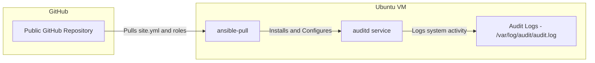

# Ansible Auditd Playbook

## Overview

This playbook lets users install and configure auditd on an Ubuntu device using Ansible's `ansible-pull` command and GitHub.

Auditd is an important security feature used on Linux devices to tracks changes to important files and other user actions. 
This playbooks specifically audits identity and privilege-related files, and is designed to run with `ansible-pull` to avoid manual updates.

---

## System Requirements

- **Operating System:** Ubuntu 24.x (tested on Ubuntu 24.04 LTS)
- **Ansible Version:** 2.16 or later
- **Git** 
- **auditd:** Installed automatically by the playbook

---

## Repository Structure

- ansible-auditd-playbook/
  - README.md - *Technical documentation*
  - site.yml - *Main playbook*
  - roles/
    - auditd/
      - tasks/main.yml - *Tasks for installing/configuring auditd*
      - handlers/main.yml - *Reloads the rules*
      - files/custom.rules - *Custom rules for the audit*
      - defaults/main.yml - *Any default variables. Currently empty.*

---

## How to Use

### Installing

The user can make a copy of the repository or use `ansible-pull` directly:

```bash
sudo apt update
sudo apt install -y ansible git
sudo ansible-pull -U https://github.com/joseywatznauer/ansible-auditd-playbook.git -C main site.yml
```

This will automatically:
1. Install `auditd` and its dependencies
2. Copy a custom rule file (`99-custom.rules`) into `/etc/audit/rules.d/`
3. Load and activate those rules using `augenrules --load`.

### Verification Steps

Run these commands to confirm that `auditd` is active and enforcing your rules:

```bash
sudo auditctl -l
sudo systemctl status auditd
sudo ausearch -k identity_changes
sudo ausearch -k exec
```

You can also trigger a test event and verify logging:

```bash
sudo touch /etc/passwd
sudo tail -n 10 /var/log/audit/audit.log
```


To verify:

```bash
sudo auditctl -l
sudo systemctl status auditd
```

You should see your custom rules listed and auditd in the "active (running)" state.


---

## Audit Rules Implemented

```bash
-w /etc/passwd -p wa -k identity_changes
-w /etc/group -p wa -k identity_changes
-w /etc/shadow -p wa -k identity_changes
-w /etc/gshadow -p wa -k identity_changes
-w /etc/sudoers -p wa -k sudoers
-w /etc/sudoers.d/ -p wa -k sudoers
-a always,exit -F arch=b64 -S execve -k exec
```

The rules implemented monitor files especially pertinent for security and all commands:
- **/etc/passwd, /etc/group, /etc/shadow, /etc/gshadow:** for modifications to user and group information.
- **/etc/sudoers:** for unauthorized changes to privilege delegation.
- **All executed commands:** to log every command run by any user.

---

## Architecture Diagram




---

## Troubleshooting Tips

| Issue | Cause | Solution |
|-------|--------|-----------|
| `ERROR! Could not find a playbook to run.` | Incorrect file structure or missing `site.yml` | Ensure `site.yml` is in the root of the repo |
| `Unsupported parameters for (ansible.legacy.copy) module: notify` | Wrong indentation of `notify` | Move `notify` outside of the module block |
| `auditctl -l` shows “no rules” | Rules not loaded | Run `sudo augenrules --load` |
| `auditd` not running | Service not enabled | `sudo systemctl enable --now auditd` |

---

## Credits

* [Ansible Documentation](https://docs.ansible.com/)
* [Linux Audit Daemon Wiki](https://linux.die.net/man/8/auditd)
* [awesome-readme](https://github.com/matiassingers/awesome-readme)
* [Creating Diagrams](https://docs.github.com/en/get-started/writing-on-github/working-with-advanced-formatting/creating-diagrams#creating-mermaid-diagrams)
* [Mermaid Documentation](https://mermaid.js.org/#/)
